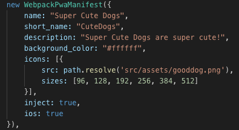
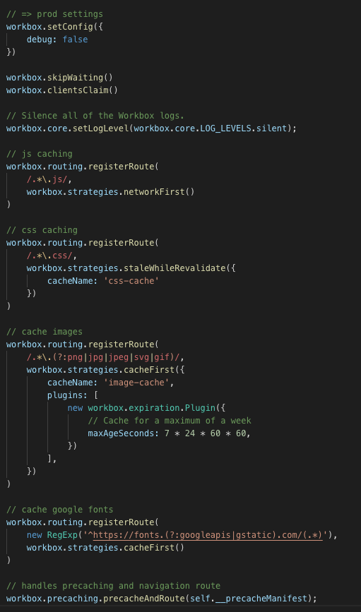

# Progressive web applications

[From Wikipedia](https://en.wikipedia.org/wiki/Progressive_web_applications): 
> Progressive web applications (PWAs) are web applications that load like regular web pages or websites but can offer the user functionality such as working offline, push notifications, and device hardware access traditionally available only to native applications.   
> PWAs combine the flexibility of the web with the experience of a native application.

How do we create a PWA?

## Requirements

This Setup assumes the Project is using webpack.

In addition to a Webpage, you require 2 more things:
1. A Manifest.
2. A Service Worker

### Manifest

The App Manifest is a json (named `manifest.json`) that describes how the app should appear for the user (for example on the home screen of the phone) once it's installed.  
The Manifest is required in order to install the PWA.

#### webpack-pwa-manifest plugin

In order to generate the Manifest, there is a webpack plugin called [webpack-pwa-manifest](https://github.com/arthurbergmz/webpack-pwa-manifest) that helps you generate the manifest.

It is fairly simple to use - just add the plugin and configure it.

It even injects it into the index file, ready to use!

#### Install Banners

In order to show the install banners, there only needs to be a listener for the `beforeinstallpromt`.  
According to this documentation [here](https://developers.google.com/web/fundamentals/app-install-banners/), you have to call .prompt() on the `beforeinstallpromt` event, but in my case, that wasn't necessary.

### Service Worker

In order to cache data, send push notification, or do some other background work, there needs to be a Service Worker.  
A Sercice Worker is also required so that the browser sends a `beforeinstallprompt` event.

* Register the Service Worker
* Install the Service Worker (if one is not installed yet or there were changes)
    * Open a cache
    * Cache something
* Return Cached responses
* 

These steps can either be done manually or we can use Workbox. I decided to use Workbox.

#### workbox-webpack-plugin plugin

[Workbox](https://developers.google.com/web/tools/workbox/) is a set of JavaScript Libraries from Google that help with caching & offlien support.  

In order to cache Javascript, you have to register a [route](https://developers.google.com/web/tools/workbox/reference-docs/latest/workbox.routing), telling it what to cache and with what [strategy](https://developers.google.com/web/tools/workbox/reference-docs/latest/workbox.strategies).

Thanks to the workbox-webpack-plugin plugin, this can be done pretty easily.

In order to have this __precacheManifest, you need to inject it into this service worker.

Since webpack knows what files are being created, it also has a list of files that should precached. 

## Links

* [Google Code Lab](https://codelabs.developers.google.com/codelabs/your-first-pwapp/)  
* [Wikipedia](https://en.wikipedia.org/wiki/Progressive_web_applications)
* [Web App Manifest Google Developers](https://developers.google.com/web/fundamentals/web-app-manifest/)
* [Webpack PWA Manifest](https://github.com/arthurbergmz/webpack-pwa-manifest)
* [Workbox](https://developers.google.com/web/tools/workbox/)
* [Service Workers](https://developers.google.com/web/fundamentals/primers/service-workers/)